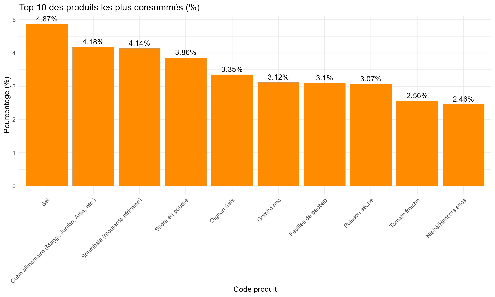

\newpage

# Préambule

## Fréquence de consommation

Pour commencer, nosu évaluons la fréquence de consommation de chaque produit à partir de la section 7B.

```{r eval=FALSE}
cons <- s07b %>%
  mutate(label_produits = as_factor(s07bq01)) %>%
  filter(s07bq02 == 1) %>%
  group_by(label_produits) %>%
  summarise(n_pondere = sum(hhweight, na.rm = TRUE)) %>%
  mutate(pourcentage = round(100 * n_pondere / sum(n_pondere), 2)) %>%
  arrange(desc(n_pondere))


```

## Part des cultures dans la superficie totale

### Challenge 1 : Harmoniser les unités (ha, m2)

Les superficies étaient tantôt exprimées en hectares, tantôt exprimées en m2. Nous avons dû harmoniser.

```{r eval=FALSE}
s16a_sup <- s16a %>%
  mutate(
    s16aq09a = zap_labels(s16aq09a),
    s16aq09b = zap_labels(s16aq09b),
    sup_hectare = ifelse(s16aq09b == 2,
                         s16aq09a / 10000,
                         s16aq09a)) %>%
  group_by(hhid) %>%
  summarise(champ = sum(sup_hectare, na.rm = TRUE))
```

### Calcul des superficies

Cette partie permet de connaître la superficie utilisée pour chaque culture.

```{r eval=FALSE}
s16_a_c <- s16c %>%
  filter(!is.na(s16cq04)) %>%
  left_join(s16a_sup, by = "hhid") %>%
  mutate(
    produit = as_factor(s16cq04),
    part_culture = case_when(
      is.na(s16cq08) & s16cq07 == 1 ~ 100,
      TRUE ~ s16cq08
    )
  ) %>%
  group_by(produit) %>%
  summarise(
    superficie = sum(champ * part_culture * hhweight / 100, na.rm = TRUE),
    poids = round(100 * superficie / total_pondere, 2)
  ) %>%
  arrange(desc(poids))

include_graphics("sorties/Sorties_preambule/top10_produits_cultives.png")
```

# Part en kg dans la consommation

### Challenge 2 : Conversion des unités non standards en Kilogramme

Afin de connaître la part de chaque culture dans la consommation en kg, il fallait convertir les quantités en unités non standard en kilogramme.

```{r eval=FALSE}
correspondance_unite <- tibble(
  label_unite    = c("Kilogramme", "Unité", "Yorouba", "Tine", "Sac moyen", "Sac gros", "Autres"),
  uniteID_conv   = c(100,           147,     149,        145,     133,         133,        999),
  tailleNom_conv = c(NA,            NA,      NA,        NA,     "Moyen",     "Grand",    NA)
)

poids_par_unite <- table_conversion_16d %>%
  filter(uniteID %in% na.omit(correspondance_unite$uniteID_conv)) %>%
  mutate(tailleNom_std = case_when(
    uniteID == 133 & tailleID == 2 ~ "Moyen",
    uniteID == 133 & tailleID == 3 ~ "Grand",
    TRUE                           ~ NA_character_
  )) %>%
  filter(uniteID != 133 | tailleID %in% c(2, 3)) %>%
  group_by(uniteID, tailleNom_std) %>%
  summarise(poids_g = mean(poids_moyen, na.rm = TRUE), .groups = "drop")

correspondance_unite_poids <- correspondance_unite %>%
  left_join(poids_par_unite,
            by = c("uniteID_conv" = "uniteID", "tailleNom_conv" = "tailleNom_std")) %>%
  mutate(poids_g  = ifelse(label_unite == "Kilogramme", 1000, poids_g),
         poids_kg = poids_g / 1000)


s16d_kg <- s16d %>%
  mutate(produit     = as_factor(s16dq01),
         label_unite = as_factor(s16dq02b)) %>%
  left_join(correspondance_unite_poids %>% select(label_unite, poids_g, poids_kg),
            by = "label_unite") %>%
  mutate(q_cons_kg = s16dq02a * poids_kg)
```

### Calcul des parts de consommation

Nous avons cherché la part de chaque culture dans la consommation afin d'analyse le top 10.

```{r eval=FALSE}
cons_cul_kg <- s16d_kg %>%
  group_by(produit) %>%
  summarise(
    part_consommation_kg = round(100 * sum(q_cons_kg * hhweight, na.rm = TRUE) / total_cons_kg, 2)
  ) %>%
  arrange(desc(part_consommation_kg))

include_graphics("sorties/Sorties_preambule/top10_produits_consommes_kg.png")
```

# Module 1

## Challenge 1 : Conversion des unités non standards en kilogramme dans la Section 7B

Certaines quantités de la section 7B étaient exprimée en unités non standards. Il fallait donc les convertir en kilogramme.

```{r eval=FALSE}
nsu <- read_dta("Données transversales/ehcvm_nsu_bfa2021.dta", encoding = "latin1")

table_conversion_nsu <- nsu %>%
  filter(!is.na(poids_moyen)) %>%
  group_by(codpr, uniteID, tailleID) %>%
  summarise(poids = mean(poids_moyen, na.rm = TRUE), .groups = "drop")

s07b_kg <- s07b %>%
  left_join(table_conversion_nsu,
            by = c("s07bq01" = "codpr",
                   "s07bq03b" = "uniteID",
                   "s07bq03c" = "tailleID")) %>%
  mutate(q_cons_kg = s07bq03a * poids / 1000)
```

## Challenge 2 : Introduction des échanges commerciaux internationaux

Pour pouvoir prendre en compte les parts des différents produits dans les échanges commerciaux internationaux, nous avons fait recours aux données FAO via FAOSTAT.

```{r eval=FALSE}
balance_table <- export_val %>%
  full_join(import_val, by = "Item", suffix = c("_export", "_import")) %>%
  filter(str_detect(Item, regex("Maize", ignore_case = TRUE))) %>%
  mutate(
    balance = val_export - val_import
  ) %>%
  slice_head(n = 1)

balance_table_2 <- export_val %>%
  full_join(import_val, by = "Item", suffix = c("_export", "_import")) %>%
  filter(str_detect(Item, regex("maize", ignore_case = TRUE))) %>%
  mutate(
    val_export = coalesce(val_export, 0),
    val_import = coalesce(val_import, 0),
    balance = val_export - val_import
  )
```

# Module 2

## Construire la typologie des ménages (producteurs / consommateurs)

Pour caractériser les ménages par rapport au maïs, nous avons construit une typologie en 4 groupes croisant la production (section 16C) et la consommation (section 7B) : Producteur-Consommateur, Producteur seul, Consommateur seul, Ni l'un ni l'autre. Le tableau maître est la base de bien-être (`ehcvm_welfare_2b`), qui contient déjà un identifiant ménage unique, le poids de sondage et les variables de milieu/région.

```{r, eval=FALSE}
# --- Producteurs : ménages qui cultivent le maïs (depuis s16c) ---
producteurs_typo <- s16c %>%
  filter(s16cq04 == code_culture_X) %>%
  distinct(hhid) %>%
  mutate(producteur = 1)

# --- Consommateurs : ménages qui mangent du maïs (depuis s07b) ---
consommateurs_typo <- s07b %>%
  filter(s07bq01 %in% codes_conso_X, s07bq02 == 1) %>%
  distinct(hhid) %>%
  mutate(consommateur = 1)

# --- Fusion et création des 4 groupes ---
menages <- ehcvm_welfare_2b %>%
  select(hhid, grappe, menage, hhweight, hhsize, pcexp, zref, milieu, region) %>%
  left_join(producteurs_typo, by = "hhid") %>%
  left_join(consommateurs_typo, by = "hhid") %>%
  replace_na(list(producteur = 0, consommateur = 0)) %>%
  mutate(groupe = case_when(
    producteur == 1 & consommateur == 1 ~ "1. Producteur-Conso",
    producteur == 1 & consommateur == 0 ~ "2. Producteur seul",
    producteur == 0 & consommateur == 1 ~ "3. Conso seul",
    producteur == 0 & consommateur == 0 ~ "4. Ni prod ni conso"
  ))

repartition <- menages %>%
  group_by(groupe) %>%
  summarise(nb_menages = sum(hhweight),
            pct = round(100 * sum(hhweight) / sum(menages$hhweight), 2))
print(repartition)
```

Point de vigilance : un ménage peut être à la fois producteur ET acheteur net du maïs (il produit mais pas assez pour ses besoins). La typologie ci-dessus ne distingue que producteur/consommateur au sens large (produit-il ? consomme-t-il ?) ; l'autosuffisance stricte serait une analyse complémentaire, non retenue ici par souci de simplicité.

## Profil socio-démographique du chef de ménage

La taille du ménage, le milieu et la dépense par tête sont déjà disponibles dans `menages` (via `ehcvm_welfare_2b`). Il reste à récupérer le sexe, l'âge et le niveau d'éducation du chef de ménage, à partir de la section 1 (`s01q02 == 1` identifie le chef) et de la section 2 (niveau d'études le plus élevé).

```{r, eval=FALSE}
chef <- s01 %>%
  filter(s01q02 == 1) %>%
  select(hhid, pid, sexe_chef = s01q01, age_chef = s01q04a) %>%
  left_join(s02_me %>% select(hhid, pid, educ_chef = s02q29), by = c("hhid", "pid"))

menages <- menages %>%
  left_join(chef %>% select(-pid), by = "hhid")
```

## Challenge : qui répond au module de sécurité alimentaire (FIES) ?

Le score FIES (section 8A, 8 questions dichotomiques) est construit en recodant chaque question en 0/1 (Oui = 1) puis en sommant. Les seuils officiels sont : insécurité **modérée** si le score ≥ 3, **sévère** si le score ≥ 6. Le sujet attire l'attention sur un risque de biais : la variable `s08aq00` identifie qui, dans le ménage, a répondu à ce module. Si c'est systématiquement le même profil de répondant (par ex. toujours le chef de ménage), les résultats pourraient être biaisés.

```{r, eval=FALSE}
# --- Score FIES (0 à 8) ---
fies <- s08a %>%
  mutate(across(s08aq01:s08aq08, ~ if_else(.x == 1, 1, 0))) %>%
  mutate(score_fies = s08aq01 + s08aq02 + s08aq03 + s08aq04 +
                     s08aq05 + s08aq06 + s08aq07 + s08aq08,
         fies_modere = if_else(score_fies >= 3, 1, 0),
         fies_severe = if_else(score_fies >= 6, 1, 0)) %>%
  select(hhid, score_fies, fies_modere, fies_severe)

menages <- menages %>%
  left_join(fies, by = "hhid")

# --- Vérification du profil du répondant (point de vigilance du sujet) ---
repondant_fies <- s08a %>%
  select(hhid, pid_repondant = s08aq00) %>%
  left_join(s01 %>% select(hhid, pid, s01q02, s01q01),
            by = c("hhid" = "hhid", "pid_repondant" = "pid")) %>%
  mutate(lien_repondant = as_factor(s01q02)) %>%
  count(lien_repondant) %>%
  mutate(pct = round(100 * n / sum(n), 2)) %>%
  arrange(desc(n))
print(repondant_fies)
```

Le répondant n'est pas systématiquement le chef de ménage : la répartition ci-dessus montre plusieurs profils de répondants, ce qui limite (sans l'éliminer) le risque d'un biais de déclaration lié à une seule personne.

## Challenge : construire le score de diversité alimentaire (HDDS)

Le HDDS compte le nombre de groupes alimentaires (sur 12, classification FAO) consommés par le ménage au cours des 7 derniers jours. La section 7B ne donne que des codes produits individuels (`s07bq01`) : il a donc fallu construire une table de passage produit → groupe FAO, en s'appuyant sur le dictionnaire de codes du questionnaire.

```{r, eval=FALSE}
# --- Table de passage code produit -> groupe alimentaire FAO ---
passage_fao <- tibble::tribble(
  ~code_produit, ~groupe_fao,
  1, "Cereales", 2, "Cereales", 3, "Cereales", 4, "Cereales", 6, "Cereales",
  7, "Cereales", 8, "Cereales", 12, "Cereales", 14, "Cereales", 16, "Cereales",
  123, "Tubercules", 124, "Tubercules", 126, "Tubercules", 128, "Tubercules",
  88, "Legumes", 89, "Legumes", 90, "Legumes", 96, "Legumes", 100, "Legumes",
  71, "Fruits", 72, "Fruits", 73, "Fruits", 76, "Fruits",
  27, "Viande", 29, "Viande", 30, "Viande", 34, "Viande",
  60, "Oeufs",
  40, "Poisson", 44, "Poisson", 51, "Poisson",
  112, "Legumineuses", 113, "Legumineuses", 114, "Legumineuses",
  52, "Lait", 53, "Lait",
  63, "Huiles", 66, "Huiles", 67, "Huiles",
  134, "Sucre"
)

# HDDS = nombre de groupes distincts consommés par le ménage (0 à 12)
hdds <- s07b %>%
  filter(s07bq02 == 1) %>%
  inner_join(passage_fao, by = c("s07bq01" = "code_produit")) %>%
  distinct(hhid, groupe_fao) %>%
  count(hhid, name = "hdds")

menages <- menages %>%
  left_join(hdds, by = "hhid") %>%
  replace_na(list(hdds = 0))
```

## Tableau comparatif des 4 groupes

Nous résumons, pour chaque groupe de la typologie, les moyennes pondérées (`hhweight`) des indicateurs socio-démographiques, de pauvreté monétaire et de sécurité alimentaire (FIES, HDDS).

```{r, eval=FALSE}
wmean <- function(x, w) weighted.mean(x, w, na.rm = TRUE)

comparatif <- menages %>%
  mutate(pauvre = if_else(pcexp < zref, 1, 0)) %>%
  group_by(groupe) %>%
  summarise(
    nb_menages         = sum(hhweight),
    age_chef           = wmean(age_chef, hhweight),
    pct_femme_chef     = 100 * wmean(sexe_chef == 2, hhweight),
    taille_menage      = wmean(hhsize, hhweight),
    pct_urbain         = 100 * wmean(milieu == 1, hhweight),
    incidence_pauvrete = 100 * wmean(pauvre, hhweight),
    fies_score         = wmean(score_fies, hhweight),
    fies_modere_pct    = 100 * wmean(fies_modere, hhweight),
    fies_severe_pct    = 100 * wmean(fies_severe, hhweight),
    hdds_moyen         = wmean(hdds, hhweight)
  )

print(comparatif %>% mutate(across(where(is.numeric), ~ round(.x, 2))))
```

```{r, eval=FALSE}
include_graphics("sorties/Sorties_module_2/profil_groupes.png")
```

Le graphique confirme l'intuition attendue : les ménages "Ni producteur ni consommateur" affichent l'incidence de pauvreté et l'insécurité alimentaire les plus faibles, tandis que les groupes en lien avec le maïs (producteurs et/ou consommateurs) sont plus exposés — cohérent avec le rôle de culture de subsistance du maïs au Burkina Faso.

# Module 3

## Challenge principal : Pas de variable de production dans les bases

Après avoir inspecté les bases de données, aucune variable indiquant directement la production agricole des ménages n'a été trouvée. Il a donc fallu regarder plus en détails les variables. Nous avons remarqué que les seules variables indiquant la production agricole des ménages ne concernent que les ménages n'ayant pas fini leur récolte. Il a donc fallu scinder les producteurs de maïs en deux groupes : ceux qui ont fini leur récolte et ceux qui n'ont pas fini. Pour ceux qui ont fini, nous avons contruit leur production en additionnant l'autoconsommation, les dons, les ventes et la quantité stockée. Pour ceux qui ont fini, la variable s16c16c ayant trop de lacunes, nous avons utilisé la table de conversion nsu pour convertir les quantités exprimées en unités non standards en kilogramme.

```{r eval=FALSE}
# Correspondances
corresp_unite <- tibble(
  code_unite   = c( 1,    3,    4,    5,    6),
  uniteID_nsu  = c(100,  149,  145,  138,  135)
)

# Recodage de la variable autres à préciser
recoder_autre <- function(texte) {
  t <- tolower(as.character(texte))
  case_when(
    grepl("bo[îi]te|botes|boites", t)              ~ 107L,
    grepl("panier", t)                             ~ 128L,
    grepl("grand tas", t)                          ~ 143L,
    grepl("sac petit", t)                          ~ 137L,
    grepl("caisse", t)                             ~ 114L,
    grepl("sachet", t)                             ~ 139L,
    grepl("tonne", t)                              ~ 100L,  # déjà en kg
    TRUE                                           ~ NA_integer_
  )
}

# Conversions
convertir_kg_nsu <- function(df, var_qte, var_unite, var_etat, var_autre = NULL) {
  tmp <- df %>%
    mutate(
      .qte       = .data[[var_qte]],
      code_unite = .data[[var_unite]],
      etat       = .data[[var_etat]],
      # Recodage des "Autres" (code 7) via le texte, si dispo
      uniteID = case_when(
        code_unite %in% corresp_unite$code_unite ~
          corresp_unite$uniteID_nsu[match(code_unite, corresp_unite$code_unite)],
        code_unite == 7 & !is.null(var_autre)     ~
          recoder_autre(.data[[var_autre]]),
        TRUE ~ NA_real_
      ),
      codpr = case_when(
        etat == 1            ~ 5,   # Épi
        etat %in% c(2, 3, 4) ~ 6,   # Grain / décortiqué / non-décortiqué
        TRUE                 ~ NA_real_)
    ) %>%
    left_join(strate_hh, by = "hhid") %>%
    left_join(nsu_mais, by = c("codpr", "uniteID", "strate"))
  
  # Si l'unité est déjà le kilogramme (uniteID 100, codpr 6), le poids NSU
  # est 1 kg : la quantité déclarée est prise telle quelle.
  tmp$.qte * tmp$poids_moyen_kg
}

convertir_kg_16d <- function(df, var_qte, var_unite, var_etat) {
  var_autre <- paste0(var_unite, "_autre")
  if (!var_autre %in% names(df)) var_autre <- NULL
  convertir_kg_nsu(df, var_qte, var_unite, var_etat, var_autre)
}
```

## Filtrage agronomique et Winsorisation

-   **Exclusion des micro-parcelles** : `surface_mais_ha >= 0.05` (0,05 ha = 500 m²), pour éviter des rendements explosifs par division par une surface quasi nulle.
-   **Plafond agronomique** : `rendement_kg_ha <= 5000`, avant même la winsorisation, un plafond dur basé sur la vraisemblance agronomique (au-delà, on considère qu'il s'agit d'une erreur de saisie plutôt qu'un rendement réel).
-   **Winsorisation p1/p99** appliquée *après* le plafond dur, sur les données déjà filtrées — décision d'appliquer les deux successivement plutôt qu'un seul mécanisme, pour combiner une borne absolue (agronomique) et une borne relative (statistique).

```{r eval=FALSE}
production_filtre <- production_mais %>%
  filter(surface_mais_ha >= 0.05,
         rendement_kg_ha <= 5000)

bornes_rendement <- quantile(production_filtre$rendement_kg_ha,
                             probs = c(0.01, 0.99), na.rm = TRUE)

production_mais_analyse <- production_filtre %>%
  filter(between(rendement_kg_ha,
                 bornes_rendement[[1]], bornes_rendement[[2]]))

cat("Observations après filtrage :", nrow(production_mais_analyse),
    "sur", nrow(production_mais), "brutes\n")

```

## Incidence de la pluviométrie

Après avoir fait la régression demandée, nous avons jugé pertinent d'inclure d'effet des précipitations. C'est pour cela que nous avons fait une régression entre la pluviométrie et le rendement.

```{r eval=FALSE}
# --- Rendement vs pluviométrie (NASA POWER) ---
get_pluie_nasa_power <- function(lon, lat) {
  url <- "https://power.larc.nasa.gov/api/temporal/daily/point"
  res <- GET(url, query = list(
    parameters = "PRECTOTCORR",
    community  = "AG",
    longitude  = lon,
    latitude   = lat,
    start      = "20210501",
    end        = "20211031",
    format     = "JSON"
  ))
  if (status_code(res) != 200) return(NA_real_)
  dat <- fromJSON(content(res, as = "text", encoding = "UTF-8"))
  valeurs <- dat$properties$parameter$PRECTOTCORR
  sum(unlist(valeurs), na.rm = TRUE)
}

points_grappes <- rendement_geo %>%
  st_drop_geometry() %>%
  select(grappe, lon, lat)

# On met en cache localement pour ne pas re-taper l'API à chaque run
if (file.exists("pluie_grappe_nasapower.rds")) {
  cat("Chargement de la pluviométrie depuis le fichier local pluie_grappe_nasapower.rds...\n")
  pluie_grappe <- readRDS("pluie_grappe_nasapower.rds")
} else {
  test <- get_pluie_nasa_power(points_grappes$lon[1], points_grappes$lat[1])
  cat("Test premier point :", test, "mm\n")
  
  pluie_grappe <- points_grappes %>%
    mutate(pluie_totale_mm = map2_dbl(lon, lat, function(lo, la) {
      Sys.sleep(0.3)
      get_pluie_nasa_power(lo, la)
    }))
  
  cat("Grappes avec pluviométrie récupérée :",
      sum(!is.na(pluie_grappe$pluie_totale_mm)), "sur", nrow(pluie_grappe), "\n")
  
  saveRDS(pluie_grappe, "pluie_grappe_nasapower.rds")
}

rendement_geo <- rendement_geo %>%
  left_join(pluie_grappe %>% select(grappe, pluie_totale_mm), by = "grappe")
```

# Module 4

## Partie 1 : Commercialisation depuis S16D

### Challenge : convertir les unités de production en kilogramme

Contrairement à la consommation (S07B), les unités de vente de la section 16D (Yorouba, Tine, Sac...) ne figurent pas dans l'Excel de conversion, qui ne couvre que les unités de consommation. Nous avons donc réutilisé la table NSU (déjà mobilisée au Module 1), en ne gardant qu'une seule clé (l'unité), car un croisement à 3 clés (produit x unité x strate) éliminait presque toutes les lignes. Nous avons aussi dû exclure les codes d'unité supérieurs à 7 dans `s16dq05b` : un contrôle des données a montré qu'il s'agit en réalité de codes cultures mal enregistrés, et non de vraies unités.

```{r, eval=FALSE}
# --- Poids moyen (g) de chaque unité, moyenne nationale (NSU) ---
passage_unite_nsu <- tibble::tribble(
  ~s16_unite, ~uniteID_nsu, ~nom_unite,
  1, 100,     "Kilogramme",
  3, 149,     "Yorouba",
  4, 145,     "Tine",
  5, 136,     "Sac moyen",
  6, 138,     "Sac gros"
)

poids_unites <- nsu %>%
  filter(!is.na(poids_moyen), uniteID %in% passage_unite_nsu$uniteID_nsu) %>%
  mutate(uniteID = as.numeric(uniteID),
         poids_sd = if_else(is.na(poids_sd), 0, poids_sd)) %>%
  group_by(uniteID) %>%
  summarise(poids_grammes = weighted.mean(poids_moyen, poids_sd, na.rm = TRUE))

# --- Sélection du maïs et nettoyage des codes d'unité corrompus (> 7) ---
base <- s16d %>%
  filter(s16dq01 == code_culture_X) %>%
  filter(s16dq05b <= 7 | is.na(s16dq05b)) %>%
  mutate(unite = as_factor(s16dq05b))

cat("Lignes maïs (après nettoyage des unités) :", nrow(base), "\n")
```

### Prix producteur et taux de commercialisation

Conformément au sujet : le **prix producteur** unitaire est le montant total de la vente (`s16dq06`) divisé par la quantité vendue convertie en kg, et le **taux de commercialisation** est le rapport entre la quantité vendue et la quantité totale produite (autoconsommation + don + vente + stock, toutes converties en kg).

```{r, eval=FALSE}
# --- Conversion des ventes en kg ---
ventes <- base %>%
  filter(s16dq04 == 1) %>%
  filter(!is.na(s16dq05a), !is.na(s16dq05b), s16dq05b <= 6) %>%
  mutate(s16dq05b = as.numeric(s16dq05b)) %>%
  left_join(passage_unite_nsu, by = c("s16dq05b" = "s16_unite")) %>%
  left_join(poids_unites, by = c("uniteID_nsu" = "uniteID")) %>%
  mutate(poids_grammes = if_else(s16dq05b == 1, 1000, poids_grammes)) %>%
  filter(!is.na(poids_grammes), poids_grammes > 0) %>%
  mutate(qte_vendue_kg = s16dq05a * poids_grammes / 1000)

# --- Prix producteur (FCFA/kg), formule du sujet ---
prix_prod <- ventes %>%
  filter(!is.na(s16dq06), s16dq06 > 0) %>%
  mutate(prix_producteur_kg = s16dq06 / qte_vendue_kg)

cat("Prix producteur moyen  :", round(weighted.mean(prix_prod$prix_producteur_kg,
    prix_prod$hhweight, na.rm = TRUE)), "FCFA/kg\n")
cat("Prix producteur median :", round(median(prix_prod$prix_producteur_kg, na.rm = TRUE)),
    "FCFA/kg\n")

# --- Taux de commercialisation : reconstitution de la production totale ---
convertir_usage_kg <- function(df, qte_col, unite_col) {
  df %>%
    mutate(.row_id = row_number(), .u = as.numeric(.data[[unite_col]])) %>%
    left_join(passage_unite_nsu, by = c(".u" = "s16_unite")) %>%
    left_join(poids_unites, by = c("uniteID_nsu" = "uniteID")) %>%
    mutate(poids_grammes = if_else(.u == 1, 1000, poids_grammes)) %>%
    mutate(qte_kg = .data[[qte_col]] * poids_grammes / 1000) %>%
    select(hhid, qte_kg)
}

conso_kg <- convertir_usage_kg(base %>% filter(!is.na(s16dq02a), !is.na(s16dq02b)),
                               "s16dq02a", "s16dq02b") %>% rename(conso_kg = qte_kg)
don_kg   <- convertir_usage_kg(base %>% filter(!is.na(s16dq03a), !is.na(s16dq03b)),
                               "s16dq03a", "s16dq03b") %>% rename(don_kg = qte_kg)
stock_kg <- convertir_usage_kg(base %>% filter(!is.na(s16dq13a), !is.na(s16dq13b)),
                               "s16dq13a", "s16dq13b") %>% rename(stock_kg = qte_kg)
vendu_kg <- ventes %>% group_by(hhid) %>% summarise(vendu_kg = sum(qte_vendue_kg, na.rm = TRUE))

taux_menage <- Reduce(function(x, y) full_join(x, y, by = "hhid"),
                      list(conso_kg, don_kg, stock_kg, vendu_kg)) %>%
  mutate(across(ends_with("_kg"), ~ replace_na(.x, 0))) %>%
  mutate(production_kg = conso_kg + don_kg + vendu_kg + stock_kg,
         taux_commercialisation = if_else(production_kg > 0,
                                          vendu_kg / production_kg, NA_real_)) %>%
  left_join(ehcvm_welfare_2b %>% select(hhid, hhweight), by = "hhid")

cat("Taux de commercialisation moyen (pondéré) :",
    round(100 * weighted.mean(taux_menage$taux_commercialisation,
        taux_menage$hhweight, na.rm = TRUE)), "%\n")
```

### Canaux de vente, stockage et pertes post-récolte

Nous décrivons ensuite le type d'acheteur (`s16dq08`), la méthode de stockage (`s16dq11`), puis les causes de pertes de récolte. Ces dernières ne sont pas dans S16D : elles se trouvent en section 16C (`s16cq14`), que nous rattachons donc au produit maïs pour ce dernier point.

```{r, eval=FALSE}
# --- Canaux de vente ---
canaux <- ventes %>%
  filter(!is.na(s16dq08)) %>%
  mutate(canal = as_factor(s16dq08)) %>%
  group_by(canal) %>%
  summarise(nb_vendeurs = sum(hhweight)) %>%
  mutate(pct = round(100 * nb_vendeurs / sum(nb_vendeurs), 1)) %>%
  arrange(desc(pct))
print(canaux)

# --- Méthodes de stockage ---
stockage <- ventes %>%
  filter(!is.na(s16dq11)) %>%
  mutate(methode = as_factor(s16dq11)) %>%
  group_by(methode) %>%
  summarise(nb = sum(hhweight)) %>%
  mutate(pct = round(100 * nb / sum(nb), 1)) %>%
  arrange(desc(pct))
print(stockage)

# --- Causes de pertes de récolte (depuis S16C) ---
pertes <- s16c %>%
  filter(s16cq04 == code_culture_X, !is.na(s16cq14)) %>%
  mutate(cause = as_factor(s16cq14))

tab_pertes <- pertes %>%
  group_by(cause) %>%
  summarise(nb_cas = sum(hhweight)) %>%
  arrange(desc(nb_cas)) %>%
  mutate(cause = factor(cause, levels = cause))
print(tab_pertes %>% mutate(nb_cas = round(nb_cas, 1)))
```

```{r, eval=FALSE}
include_graphics("sorties/Sorties_module_4/graph_pertes_par_cause.png")
```

## Partie 2 : Depuis S07B (consommateur)

### Prix à la consommation et part d'autoconsommation

Ici, contrairement à S16D, les unités déclarées (Boîte, Bassine, Sac 25kg...) sont bien des unités de *consommation* : elles figurent dans l'Excel de conversion (méthode du Cours 7, clé produit x unité x taille), et non dans le NSU. Le prix à la consommation est la valeur du dernier achat (`s07bq08`) rapportée à la quantité achetée (`s07bq07a`) convertie en kg ; la part d'autoconsommation compare, en kg, la quantité autoproduite (`s07bq04`) à la quantité totale consommée (`s07bq03a`).

```{r, eval=FALSE}
# --- Table de conversion (Cours 7) ---
table_conversion <- Table_de_conversion %>%
  filter(!is.na(poids)) %>%
  mutate(poids = as.numeric(poids),
         Utable = uniteID, Ttable = tailleID,
         Key = paste0(produitID, Utable, Ttable)) %>%
  select(produitID, Key, poids, Utable, Ttable) %>%
  distinct()

# --- Prix à la consommation ---
conso_achat <- s07b %>%
  filter(s07bq01 %in% codes_conso_X, s07bq02 == 1) %>%
  filter(!is.na(s07bq07a), s07bq07a > 0, !is.na(s07bq08), s07bq08 > 0) %>%
  mutate(produitID = s07bq01, Utable = s07bq07b,
         Ttable = if_else(is.na(s07bq07c), 0, s07bq07c),
         Key = paste0(produitID, Utable, Ttable)) %>%
  left_join(table_conversion %>% select(Key, poids), by = "Key") %>%
  filter(!is.na(poids), poids > 0) %>%
  mutate(qte_achetee_kg = s07bq07a * poids / 1000,
         prix_conso_kg  = s07bq08 / qte_achetee_kg)

cat("Prix conso moyen (pondéré) :",
    round(weighted.mean(conso_achat$prix_conso_kg, conso_achat$hhweight, na.rm = TRUE)),
    "FCFA/kg\n")

# --- Part d'autoconsommation (en quantité, kg) ---
autoconso_ratio <- s07b %>%
  filter(s07bq01 %in% codes_conso_X, s07bq02 == 1, !is.na(s07bq03a), s07bq03a > 0) %>%
  mutate(produitID = s07bq01, Utable = s07bq03b,
         Ttable = if_else(is.na(s07bq03c), 0, s07bq03c),
         Key = paste0(produitID, Utable, Ttable)) %>%
  left_join(table_conversion %>% select(Key, poids), by = "Key") %>%
  filter(!is.na(poids), poids > 0) %>%
  mutate(qte_conso_kg = s07bq03a * poids / 1000,
         qte_auto_kg  = if_else(!is.na(s07bq04), s07bq04 * poids / 1000, 0),
         ratio_autoconso = qte_auto_kg / qte_conso_kg)

cat("Part d'autoconsommation moyenne (pondérée) :",
    round(100 * weighted.mean(autoconso_ratio$ratio_autoconso,
        autoconso_ratio$hhweight, na.rm = TRUE)), "%\n")
```

## Partie 3 : Cartographie et marge commerciale

### Challenge : le questionnaire communautaire (QC-S5) n'est pas disponible

Le sujet demande de calculer la marge commerciale approchée (prix marché QC-S5 moins prix producteur S16D) au niveau de la grappe. Or QC-S5 n'existe pas dans nos données, et un village qui *vend* du maïs n'a en général aucun ménage qui l'*achète* dans le même village : une jointure au niveau grappe donnerait 0 observation exploitable. Nous avons donc choisi une solution plus robuste : calculer la marge (prix consommation S07B moins prix producteur S16D) au niveau **région** (13 régions), où les deux prix coexistent en nombre suffisant.

```{r, eval=FALSE}
geo_menages <- ehcvm_welfare_2b %>% select(hhid, region)

# --- Prix producteur moyen par région ---
prix_prod_region <- prix_prod %>%
  left_join(geo_menages, by = "hhid") %>%
  group_by(region) %>%
  summarise(prix_prod = weighted.mean(prix_producteur_kg, hhweight, na.rm = TRUE))

# --- Prix consommation moyen par région ---
prix_conso_region <- conso_achat %>%
  left_join(geo_menages, by = "hhid") %>%
  group_by(region) %>%
  summarise(prix_conso = weighted.mean(prix_conso_kg, hhweight, na.rm = TRUE))

# --- Marge commerciale par région ---
marge_region <- prix_prod_region %>%
  full_join(prix_conso_region, by = "region") %>%
  mutate(marge = prix_conso - prix_prod, nom_region = as_factor(region)) %>%
  filter(is.finite(marge)) %>%
  arrange(desc(marge))

print(marge_region %>% mutate(across(where(is.numeric), ~ round(.x, 0))))

# --- Zones prioritaires : régions à marge la plus élevée ---
zones_prioritaires <- marge_region %>% head(3)
print(zones_prioritaires %>% mutate(across(where(is.numeric), ~ round(.x, 0))))
```

```{r, eval=FALSE}
include_graphics("sorties/Sorties_module_4/graph_marge_region.png")
```

Les cartes interactives des prix producteurs (observés et interpolés par IDW avec `gstat`/`leaflet`) sont sauvegardées en HTML dans `sorties/Sorties_module_4/` (`carte_prix_producteur_points.html`, `carte_prix_producteur_interp.html` et `carte_prix_producteur_zones.html`) et consultables directement dans le navigateur ; elles ne sont pas reproduites ici pour garder ce carnet lisible en PDF.

Les régions identifiées comme prioritaires sont celles où l'écart entre prix à la consommation et prix producteur est le plus élevé : ce sont les zones où un renforcement des circuits de commercialisation (réduction des intermédiaires, infrastructures de marché) bénéficierait le plus directement aux producteurs.
