```{r setup, include=FALSE}
options(htmltools.dir.version = FALSE)
knitr::opts_chunk$set(
  echo        = FALSE,
  fig.align   = "center",
  message     = FALSE,
  warning     = FALSE,
  out.width   = "80%"
)

library(tidyverse)
library(knitr)
library(kableExtra)

# ── Charger les objets pré-calculés ────────────────────────────────────────
tab_m2 <- readRDS("sorties/tab_m2_profil.rds")
tab_m3 <- readRDS("sorties/tab_m3_rendement.rds")
tab_m4 <- readRDS("sorties/tab_m4_marge.rds")
tab_m5 <- readRDS("sorties/tab_m5_fies.rds")
```

class: title-slide, center, middle
background-image: url("sorties/mais.jpg")
background-size: cover

# Analyse de la Filière Maïs
## Du Champ à l'Assiette au Burkina Faso (EHCVM 2021)

<br>
**Jonathan David Manga & Anta Ndao**  
Encadrant : M. Mouhamadou Hady Diallo  
*ISEP2 — Projet de Statistique Appliquée avec R*

---

# Sommaire

.pull-left[
### 📊 Analyse de la Filière
1. **Contexte & Enjeux nationaux**
2. **Pourquoi le Maïs ?** *(Module 1)*
3. **Profilage des ménages** *(Module 2)*
4. **Production & Rendements** *(Module 3)*
5. **Commercialisation & Prix** *(Module 4)*
6. **Sécurité Alimentaire & Maïs** *(Module 5)*
]

.pull-right[
### 🎯 Impact & Livrables
6. **Impact sur la sécurité alimentaire** *(Module 5)*
7. **Le Package R** `filiereBFA`
8. **Limites Recommandations & Conclusion**

<br>
.alerte[
**Périmètre de l'étude :**  
Données nationales EHCVM 2021 (7 176 ménages, 600 grappes, 13 régions du Burkina Faso)
]
]

---

class: inverse, center, middle

# 1. Contexte & Enjeux Nationaux

---

# Le Burkina Faso face au défi céréalier

.pull-left[
### Un contexte agro-économique sous contrainte
- **Agriculture** : Secteur clé occupant **environ 77 %** de la population active.
- **VULNÉRABILITÉ** : Dépendance forte aux aléas climatiques (pluviométrie) et à l'insécurité civile.
- **Sécurité Alimentaire** : Les céréales fournissent la majorité des apports caloriques quotidiens au Sahel.

### La source de données : EHCVM 2021
- **Harmonisation UEMOA** : Données représentatives au niveau national, urbain/rural et régional.
- **Richesse micro-économique** : Enquêtes intégrées Ménage (S07B, S08A, S16A-D) et Communautaires (QC).
]

.pull-right[
.center[
```{r ctx-graph, out.width="100%"}
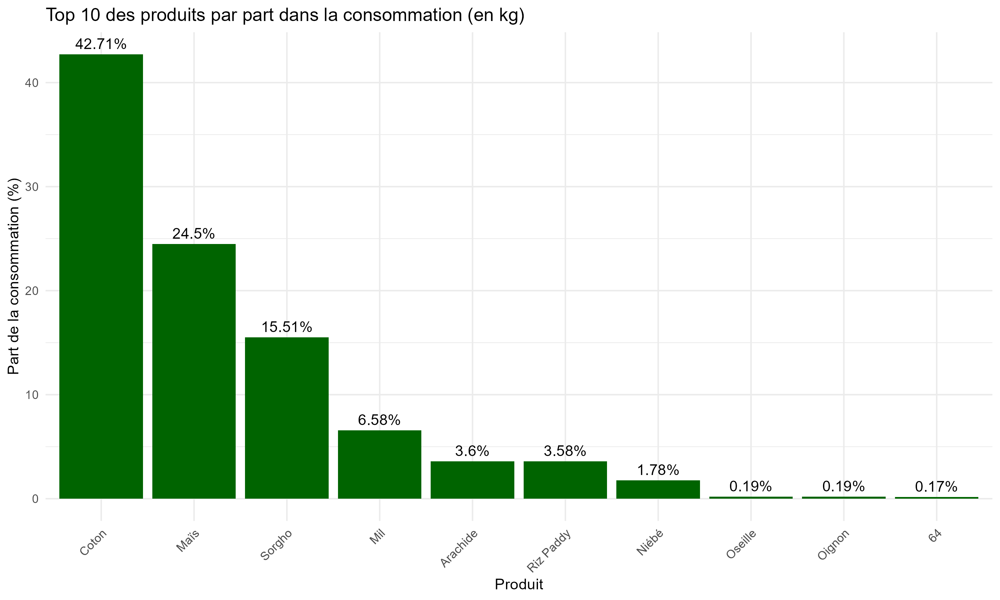
```
]
.footnote[*Top 10 des produits les plus consommés (en kg) — Source: EHCVM 2021*]
]

---

class: inverse, center, middle

# 2. Module 1 : Choix et Justification de la Filière

---

# La Première Céréale du Pays (Superficie & Ventes)

.pull-left[
.center[
### Part dans la superficie totale
```{r m1-cultives, out.width="100%"}
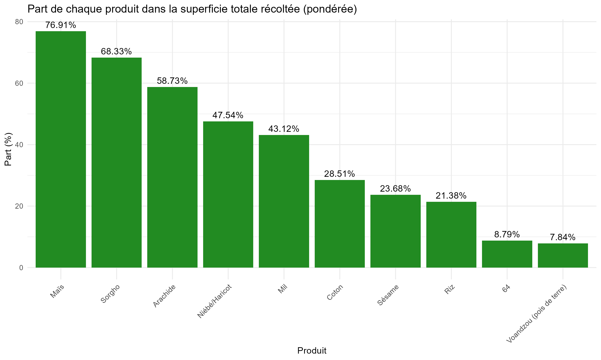
```
]
]

.pull-right[
.center[
### Part dans les ventes agricoles
```{r m1-vendus, out.width="100%"}
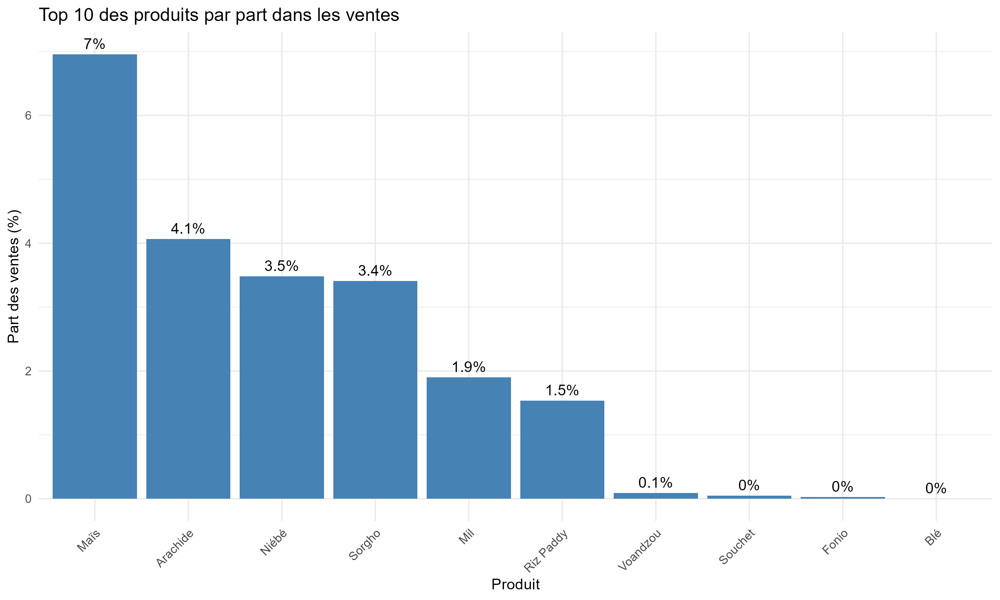
```
]
]

.resultat[
**Le Maïs domine le paysage agricole burkinabè** : C'est la 1ère culture en termes de superficie mobilisée et la 1ère culture vendue sur le territoire national.
]

---

# Production

.pull-left[
.center[
### Part en terme de production
```{r m1-sources, out.width="90%"}
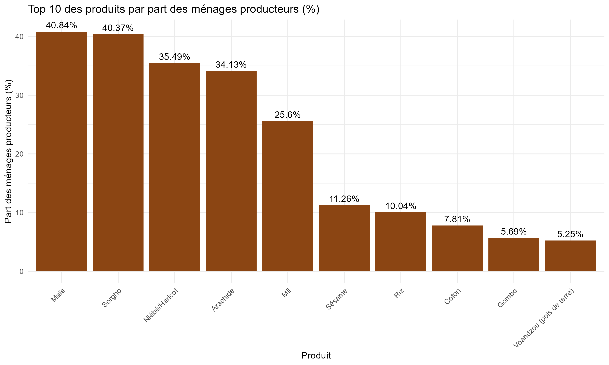
```
]
]

.pull-right[
.alerte[
**Constat clé :** **40,8 %** des ménages produisent le maïs, ce qui confirme son positionnement en tant que produit stratégique.
]

<br>
.center[
### Sources d'approvisionnement du maïs
```{r m1-sources-approv, out.width="88%"}
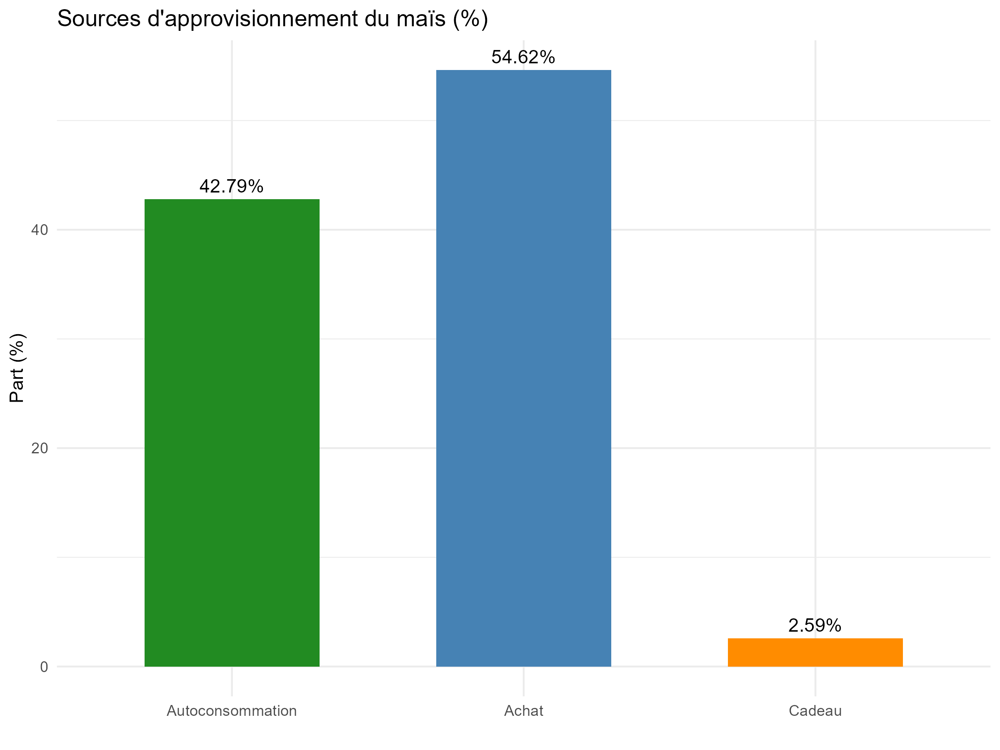
```
]
]

---

# Quantités & Calories : la place du maïs dans l'assiette

.pull-left[
.resultat[
**Une source énergétique majeure.** Le maïs intervient sous plusieurs formes dans la consommation des ménages : épi, grain, farine et semoule. Converties en kg via la **base NSU** (poids calibrés par strate *région × milieu*), les quantités consommées confirment qu'il constitue un pilier calorique, en particulier chez les ménages ruraux producteurs.
]
]

.pull-right[
.alerte[
**De la production à la consommation :** les ménages producteurs couvrent une part importante de leurs besoins par **autoconsommation**, ce qui les protège des fluctuations de prix — un argument central pour le Module 2 (typologie) et le Module 5 (impact sur la sécurité alimentaire).
]
]

---

# Commerce Extérieur & Balance Commerciale (FAOSTAT)

.pull-left[
.center[
### Importations (tonnes)
```{r m1-imp, out.width="95%"}
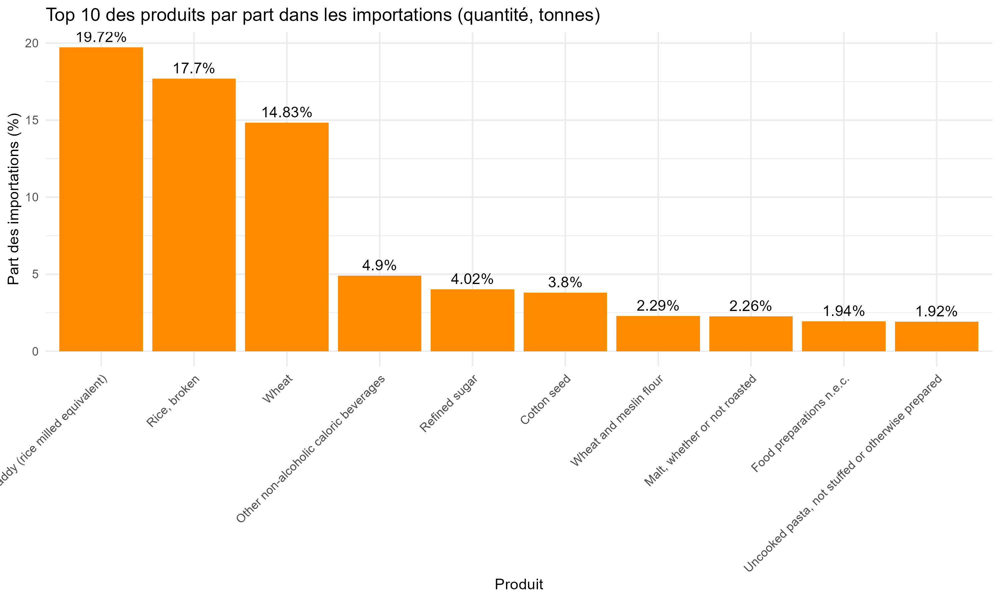
```
]
]

.pull-right[
.center[
### Exportations (tonnes)
```{r m1-exp, out.width="95%"}
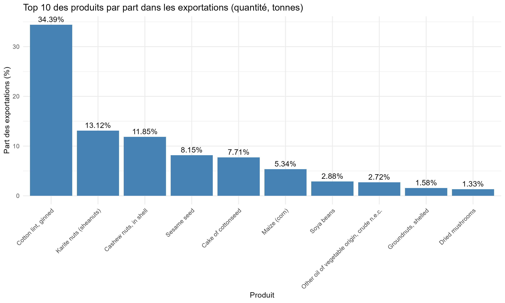
```
]
]

.resultat[
**Analyse du commerce :** Le maïs est **peu importé**, ce qui révèle une bonne capacité de prise en charge de la demande par la production nationale. Il figure par ailleurs dans le **top 10 des produits les plus exportés**, confirmant son rôle stratégique dans les échanges agricoles du pays.
]

---

class: inverse, center, middle

# 3. Module 2 : Profilage Socio-économique des Ménages

---

# Une Typologie en 4 Groupes Intégrés

.pull-left[
### Construction de la typologie

À partir des sections **S16C** (culture) et **S07B** (consommation), nous répartissons la population en 4 groupes distincts :

1. **Producteur-Consommateur** : Cultive et consomme du maïs.
2. **Producteur uniquement** : Cultive du maïs mais n'en déclare pas la consommation directe.
3. **Consommateur uniquement** : Dépend entièrement des achats sur le marché.
4. **Ni producteur ni consommateur** : Ménages hors filière.

.alerte[
**Intérêt théorique :** Cette classification permet d'isoler l'effet direct de l'autoconsommation vs. la vulnérabilité liée aux chocs de prix sur les marchés.
]
]

.pull-right[
.center[
### Sécurité alimentaire & pauvreté par groupe
```{r m2-profil, out.width="100%"}
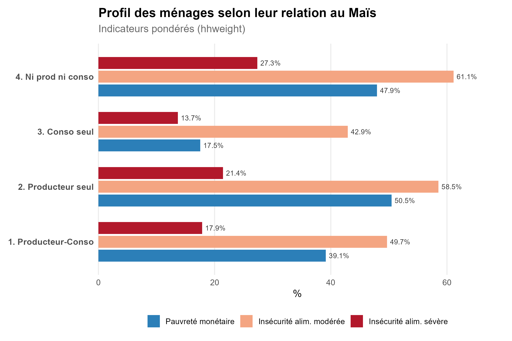
```
]
]

---

# Comparatif des Indicateurs par Groupe


.center[
```{r tab-m2}
tab_m2 %>%
  mutate(
    nb_menages = scales::comma(round(nb_menages)),
    across(where(is.numeric), ~ round(.x, 1))
  ) %>%
  rename(
    Groupe = groupe,
    `Ménages (pond.)` = nb_menages,
    `Âge Chef` = age_chef,
    `% Femme` = pct_femme_chef,
    `Taille` = taille_menage,
    `% Urbain` = pct_urbain,
    `% Pauvres` = incidence_pauvrete,
    `Score FIES` = fies_score,
    `% FIES Mod.` = fies_modere_pct,
    `% FIES Sév.` = fies_severe_pct,
    `HDDS` = hdds_moyen
  ) %>%
  knitr::kable(format = "html", align = "c") %>%
  kableExtra::kable_styling(
    bootstrap_options = c("striped", "hover", "condensed"),
    font_size = 12, full_width = FALSE
  ) %>%
  kableExtra::row_spec(1, bold = TRUE, background = "#d8e6f7")
```
]

<br>

.resultat[
**Lecture du tableau :** Les ménages **Consommateurs uniquement** (urbains à 63 %) affichent le meilleur score FIES (2,4) et la plus faible pauvreté (17,5 %) — reflet de leur revenu marchand. Les **Producteurs-Consommateurs** conservent un FIES bas (2,9) malgré une pauvreté élevée (39 %) : l'autoconsommation protège contre la faim. À l'inverse, le groupe **"Ni producteur ni consommateur"** cumule le score FIES le plus élevé (3,5) et une insécurité sévère de **27 %** — la double vulnérabilité, hors filière maïs.
]

.footnote[*FIES (0-8, élevé = forte insécurité). HDDS (0-12, élevé = meilleure diversité alimentaire).*]
---

class: inverse, center, middle

# 4. Module 3 : Production & Rendements Agricoles

---

# Harmonisation des Unités & Filtrage Agronomique

.pull-left[
### Réconciliation des Unités Locales
- **Le Défi :** Utilisation fréquente d'unités locales (Tine, Yorouba, Sacs).
- **Solution :** Harmonisation en **kg** à partir de la Table de conversion nationale Phase 2.

### Méthode de calcul de la production
- La section 16c ne présente pas de variable déterminant directement la production des ménages mais il y en a une pour les ménages n'ayant pas fini leur récolte.
- La section 16d a été utilisée pour obtenir la production des ménages ayant fini leur récolte
- Production (s16d) = Autocons + Don + Vente + Stock.

### Winsorisation
- Winsorisation au centile $p_1 / p_{99}$ pour traiter les valeurs aberrantes.
]

.pull-right[
### Bilan National Estimé

.center[
```{r tab-m3}
tab_m3 %>%
  pivot_longer(everything(), names_to = "Indicateur", values_to = "Valeur") %>%
  mutate(
    Valeur = round(as.numeric(Valeur), 1),
    Indicateur = case_when(
      Indicateur == "production_nationale_tonnes" ~ "Production nationale (tonnes)",
      Indicateur == "rendement_national_kg_ha" ~ "Rendement national (kg/ha)",
      TRUE ~ Indicateur
    )
  ) %>%
  knitr::kable(format = "html", align = "c") %>%
  kableExtra::kable_styling(bootstrap_options = c("striped", "hover"), font_size = 13, full_width = TRUE)
```
]

.alerte[
**Ecart FAOSTAT :** Rendement national estimé à **~748 kg/ha** contre **1 521 kg/ha** (FAOSTAT), s'expliquant :
- Absence d'équivalent en unité standard de certaines unités locales.
- Les quantités stockées ou autoconsommées sont observées uniquement au moment de l'enquête.
- Les statistiques FAOSTAT correspondent à une estimation théorique de la production nationale.
]
]

---

# Dispersion & Cartographie des Rendements

.pull-left[
.resultat[
**Lecture de la carte :** La majorité des grappes affichent des rendements modérés à faibles (teintes violettes, autour de 500-1 000 kg/ha), avec une **forte hétérogénéité intra-nationale** : coexistence de ménages à faible rendement et de foyers plus performants au sein d'une même zone. Les rendements les plus élevés (points jaunes/verts) se concentrent davantage dans l'**Est du pays**, avec toutefois une proportion non négligeable de bons rendements également observée dans la **région Centre**.
]
]
.pull-right[
.center[
### Variabilité spatiale par grappe
```{r m3-carte, out.width="100%"}
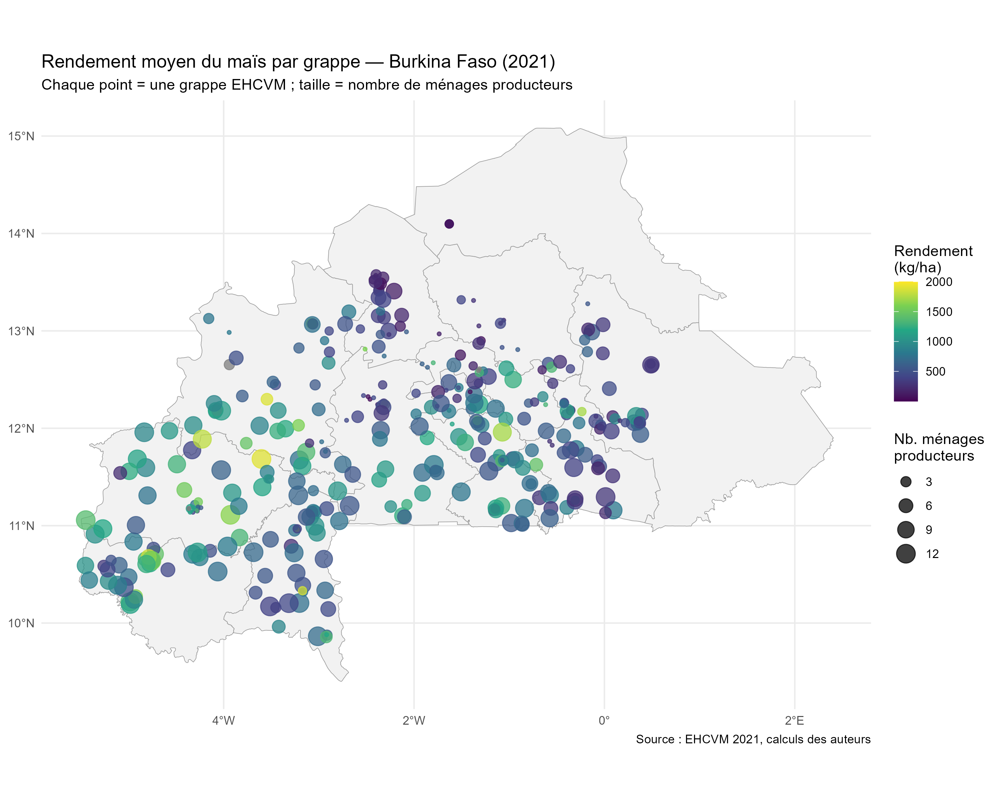
```
]
]

---

# Facteurs Explicatifs : Pluviométrie & Intrants

.pull-left[
.center[
### Corrélation avec les pluies (NASA POWER)
```{r m3-pluie, out.width="100%"}
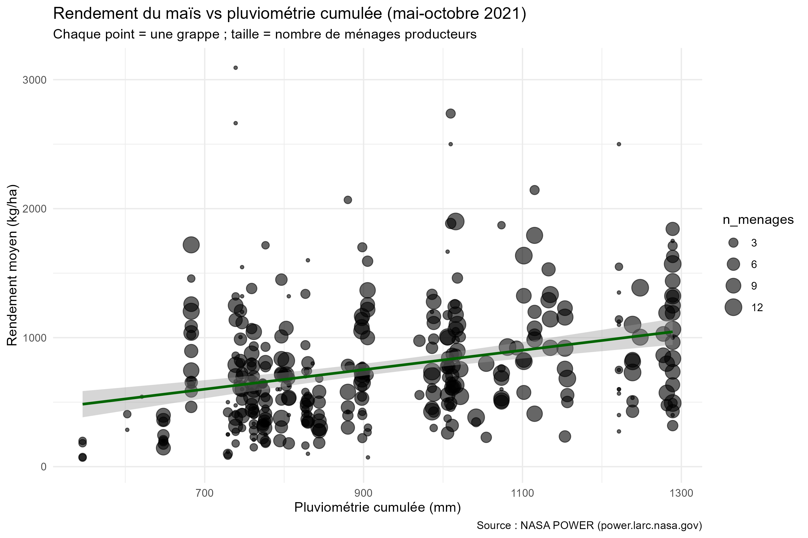
```
]
]

.pull-right[
.center[
### Taux d'utilisation des intrants
```{r m3-intrants, out.width="100%"}
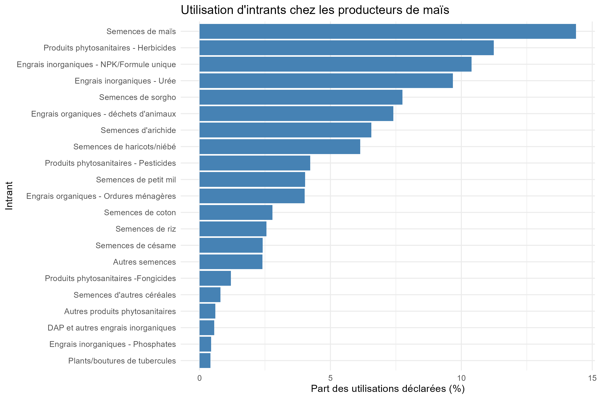
```
]
]

.resultat[
Chaque millimètre supplémentaire de pluie est associé à une augmentation moyenne d’environ
0,66 kg/ha du rendement.
]

---

# Analyse des déterminants du rendement maïs

.pull-left[
.center[
### Influence des divers variables
```{r  out.width="100%"}
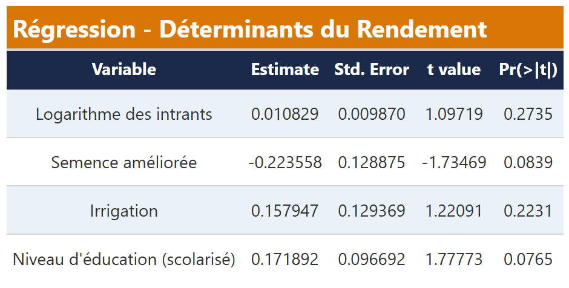
```
]]


.pull-right[
.resultat[
Seuls le niveau d'éducation du chef de ménage (+17,2 %) et, de façon plus surprenante, la semence améliorée (-22,4 %) montrent un effet marginalement significatif sur le rendement (seuil de 10 %) ; les intrants et l'irrigation, bien que positivement associés au rendement, ne ressortent pas comme statistiquement significatifs dans ce modèle.
]]


.resultat[
Le modèle capte 23,7 % de la variance globale du rendement, mais seulement 1,4 % une fois les effets fixes contrôlés — signe que les variables individuelles (intrants, semences, irrigation, éducation) expliquent peu la variation résiduelle du rendement, l'essentiel étant absorbé par les effets géographiques.

]
---
class: inverse, center, middle

# 5. Module 4 : Commercialisation & Marge Commerciale

---

# La Structure des Prix sur la Chaîne de Valeur

.col3[
<div class="chiffre-box">
  <span class="val">414 FCFA</span>
  <span class="lab">Prix Producteur Moyen (/kg)</span>
</div>
<div class="chiffre-box">
  <span class="val">1 066 FCFA</span>
  <span class="lab">Prix Consommateur Moyen (/kg)</span>
</div>
<div class="chiffre-box">
  <span class="val">652 FCFA</span>
  <span class="lab">Marge Brute Moyenne (/kg)</span>
</div>
]

<br>
.resultat[
**Un coefficient multiplicateur de 2,57×** entre le champ et l'assiette. Les coûts de transport, le manque d'infrastructures de stockage et le rôle des intermédiaires pèsent lourdement sur le prix final.
]

---

# Analyse Spatiale des Marges Régionales

.pull-left[
.center[
```{r m4-marge, out.width="100%"}
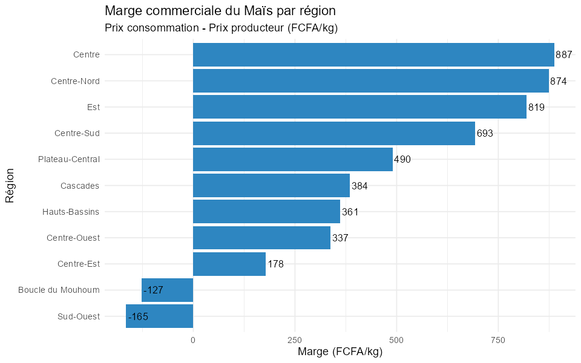
```
]
.resultat[
**Forte disparité régionale :** La marge varie de **887 FCFA/kg** dans les régions les plus rentables (régions 3 et 5) à des **marges négatives** (jusqu'à -165 FCFA/kg) dans les régions 1 et 13.
]
]

.pull-right[
.center[
```{r m4-pertes, out.width="100%"}
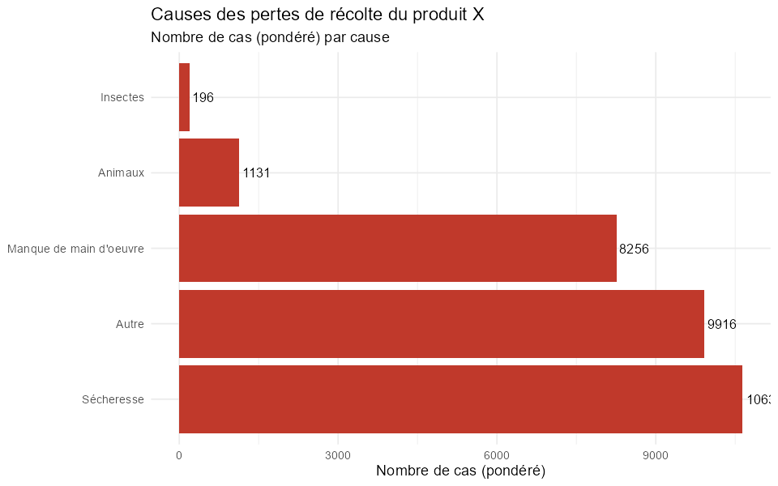
```
]
.resultat[
**La sécheresse, cause dominante :** Elle génère plus de **10 600 cas** de pertes, loin devant le manque de main d'œuvre (8 256) et les animaux (1 131). Les insectes ne pèsent que 196 cas.
]
]

---

class: inverse, center, middle

# 6. Module 5 : Analyse d'Impact sur la Sécurité Alimentaire

---

# Spécification Économétrique à Effets Fixes

Afin de tester l'impact de la filière sur l'insécurité alimentaire, nous estimons le modèle :

$$\text{FIES}_i = \alpha + \beta_1 \text{Producteur}_i + \beta_2 \ln(\text{Revenu Maïs}_i) + \beta_3 \text{Taux Vente}_i + X'_i \gamma + \delta_{\text{région}} + \varepsilon_i$$

.pull-left[
### Variables explicatives ($X_i$)
- Taille du ménage
- Scolarisation du chef de ménage
- Possession de terres agricoles
- Effets fixes Région & Milieu
]

.pull-right[
### Variables dépendantes alternées
1. **Score FIES** (Inquiétude, Faim)
2. **Score HDDS** (Diversité alimentaire)
]

---

# Résultats Économétriques (Coefficients Estimés)

.pull-left[
.center[
```{r m5-coefs, out.width="100%"}
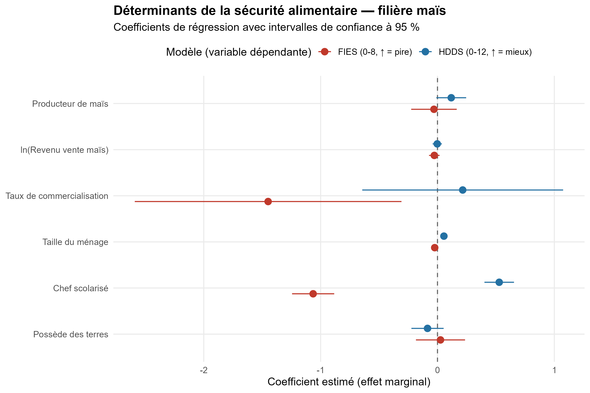
```
]
]

.pull-right[
.center[

.resultat[
**Conclusion économétrique :** C'est la scolarisation du chef de ménage (Chef scolarisé) qui apparaît comme le déterminant le plus robuste et le plus cohérent de la sécurité alimentaire, sur les deux indicateurs à la fois :
- Sur le FIES (rouge) : effet négatif net et marqué (environ -1), donc une réduction de l'insécurité alimentaire ;
- Sur le HDDS (bleu) : effet positif net (environ +0.3 à +0.4), donc une meilleure diversité alimentaire.
]]
]

---
# Hétérogénéité spatiale de l'effet filière sur le score FIES

Afin d'analyser si l'effet de la filière maïs varie selon les caractéristiques locales 
et les dispositifs d'accompagnement, nous estimons des modèles avec termes d'interaction :


$$\text{FIES}_i = \alpha + \beta_1 Filière_i + \beta_2 Z_i+ \beta_3(Filière_i \times Z_i)+ X'_i\gamma + \delta_{\text{région}} + \varepsilon_i$$


.pull-left[
### Variables explicatives ($X_i$)

- Producteur de maïs
- $\ln$(Revenu issu de la vente de maïs)
- Taux de commercialisation
- Taille du ménage
- Niveau d'éducation du chef de ménage
- Possession de terres agricoles

**Effets fixes :**
- Région
- Milieu de résidence
]

.pull-right[
### Effets d'interaction étudiés

1. **Interaction coopération**
   
   - Taux de vente × Présence d'une coopérative villageoise

2. **Interaction irrigation**
   
   - Producteur × Irrigation pratiquée au niveau du village
]


---

# Résultats : Hétérogénéité spatiale de l'effet filière

.pull-left[
.center[
```{r m5-heterogeneite, out.width="100%"}
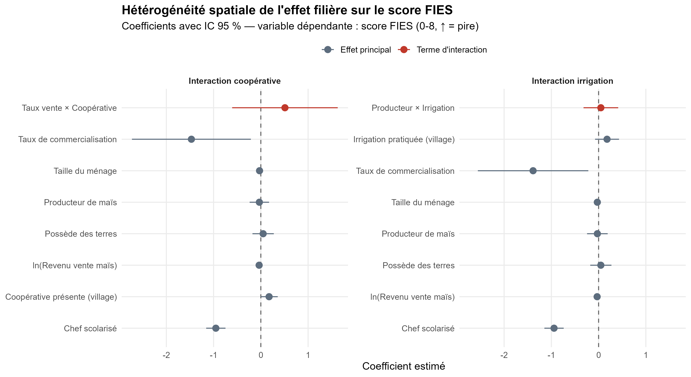
```

]
]

.pull-right[

.resultat[

Principaux enseignements
L'effet de la filière maïs sur la sécurité alimentaire n'est pas homogène selon les contextes locaux.
La commercialisation du maïs présente un effet négatif sur le score FIES, suggérant une réduction de l'insécurité alimentaire lorsque les ménages sont davantage intégrés au marché.
L'interaction taux de vente × coopérative est positive mais incertaine, indiquant que la présence d'une organisation collective ne renforce pas systématiquement l'effet commercial.
L'interaction avec l'irrigation montre également une faible différenciation de l'effet producteur, suggérant que les mécanismes d'accès au marché semblent plus déterminants que la seule capacité productive.

]

]
---


class: inverse, center, middle

# 7. Le Package R `filiereBFA`

---

# Un Outil Reproductible et Généralisable

.pull-left[
### Fonctions Clés du Package
- `load_filiere()` : Chargement automatisé des sections EHCVM.
- `calc_rendement()` : Harmonisation et nettoyage des rendements.
- `calc_fies()` & `calc_hdds()` : Calcul des indicateurs de sécurité alimentaire.
- `prix_chaine()` : Estimation des prix producteurs, consommateur et des marges.
- `carte_filiere()` : Génération de cartes Leaflet interactives.
]

.pull-right[
.resultat[
**Généralisation UEMOA :**  
Le package est conçu de façon modulaire et peut être déployé sur d'autres pays de la zone UEMOA partageant le masque d'enquête EHCVM.
]
]

---

class: inverse, center, middle

# 8. Limites et  Recommandations de Politiques Publiques


---

# Limites de l'étude

.alerte[
Production non observée directement, reconstituée à partir des usages déclarés.
]

.alerte[
Certaines unités locales de mesure n'ont pas pu être converties.
]

.alerte[
Intrants mesurés au niveau du ménage, non par culture.
]

.alerte[
Variables clés absentes du modèle (sols, pratiques, irrigation réelle).
]

.resultat[
**À retenir :** les résultats sont des associations statistiques, non des relations causales.
]
---
# Recommandations Opérationnelles

.pull-left[
### 1. Soutien à la Productivité
- **Intrants & Semences** : Élargir l'accès aux semences améliorées adaptées à la sécheresse.
- **Irrigation** : Développer la petite irrigation pour réduire la dépendance pluviométrique.

### 2. Structuration du Marché
- **Réduction des Marges** : Améliorer les pistes rurales et désenclaver les zones de production.
- **Stockage** : Investir dans des magasins de stockage modernes pour réduire les pertes post-récolte.
]

.pull-right[
### 3. Organisation des Producteurs
- **Coopératives** : Renforcer le rôle des groupements pour accroître le pouvoir de négociation des agriculteurs.
- **Transparence des Prix** : Mettre en place des systèmes d'information sur les prix des marchés locaux.

<br>
.alerte[
**Objectif Final :** Transformer le maïs d'une culture de subsistance à bas rendement en un véritable levier de croissance rurale.
]
]

---

class: inverse, center, middle

# Merci de votre attention !

### Des questions ou des commentaires ?

<br>

**Jonathan David Manga & Anta Ndao**  
*ISEP2 — Année Académique 2025/2026*  
Encadrant : M. Mouhamadou Hady Diallo